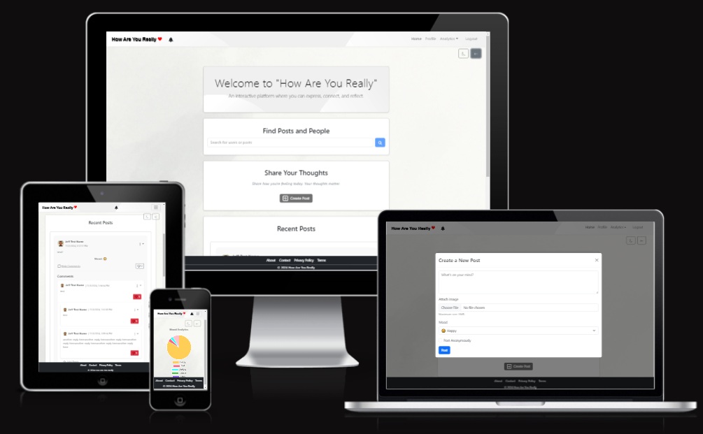
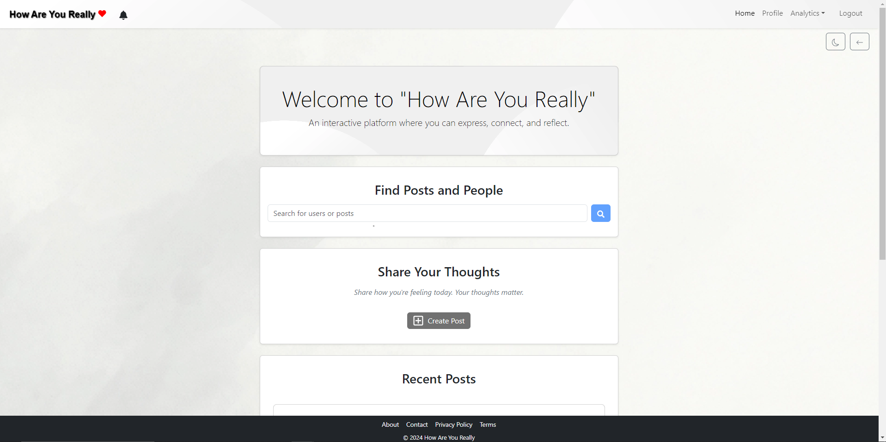
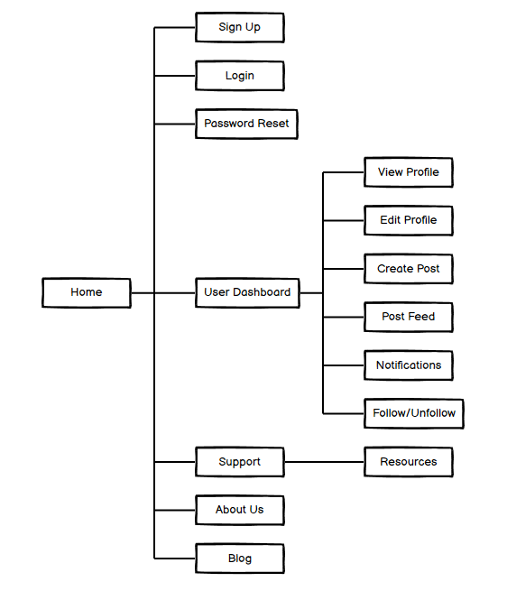
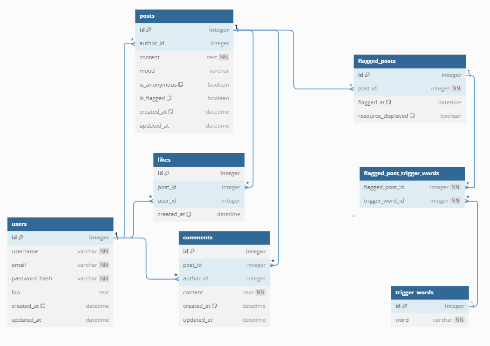
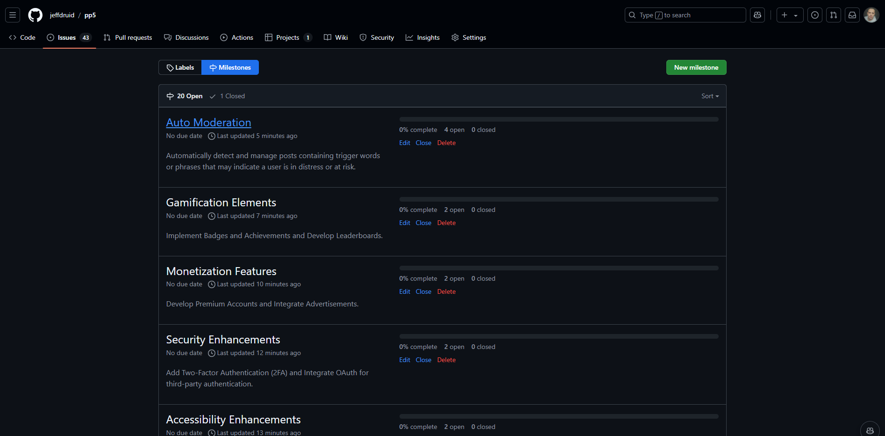
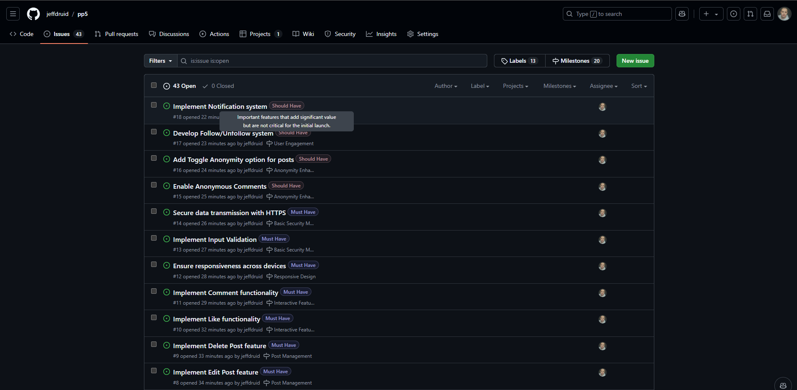

# [How Are You Really - Full Stack Web Application](https://how-are-you-really.web.app/)

<a href="https://how-are-you-really.web.app/">
  
</a>

## Introduction

**How Are You Really** is a full-stack web application designed to provide users with a platform to share their feelings, thoughts, and experiences. Inspired by social media platforms, it emphasizes anonymity and genuine expression, allowing users to connect and support each other in a safe environment.


View the live project [here](https://how-are-you-really.web.app/)

## Project Objectives

### Primary Goals

- Facilitate Emotional Expression: Provide users with a safe and supportive platform to share their feelings and thoughts.
- Ensure User Anonymity: Allow users to post anonymously to encourage genuine and honest expression without fear of judgment.
- Promote Community Engagement: Enable interactions through likes, comments, and follows to build a supportive community.
- Maintain Data Security and Privacy: Protect user data and ensure secure authentication and authorization processes.
- Deliver an Intuitive and Responsive UI/UX: Create a user-friendly interface that is accessible across various devices.

## Table of Contents

- TODO

1. [Introduction](#introduction)
2. [Technologies Used](#technologies-used)
3. [User Stories](#user-stories)
4. [Wireframes](#wireframes)
   - [Site Map](#site-map)
   - [Database Schema](#database-schema)
5. [Features](#features)
6. [MoSCoW Prioritization](#moscow-prioritization)
   - [Must Have](#must-have)
   - [Should Have](#should-have)
   - [Could Have](#could-have)
   - [Won't Have (for now)](#wont-have-for-now)
7. [GitHub Projects, Milestones, and Issues](#github-projects-milestones-and-issues)
   - [GitHub Projects](#github-projects)
   - [Milestones](#milestones)
   - [Issues](#issues)
8. [Troubleshooting](#troubleshooting)
   - [Password Reset](#password-reset)
9. [Testing](#testing)
10. [Bugs](#bugs)
    - [Fixed Bugs](#fixed-bugs)
11. [UI Improvements](#ui-improvements)
12. [Future Improvements](#future-improvements)
13. [Setup](#setup)
    - [Prerequisites](#prerequisites)
    - [Installation](#installation)
    - [Usage](#usage)
14. [Deployment](#deployment)
    - [Cloning & Forking](#cloning--forking)
    - [Local Deployment](#local-deployment)
    - [Remote Deployment (Heroku)](#remote-deployment-heroku)
15. [Credits](#credits)
    - [Source Code](#source-code)
    - [Useful links](#useful-links)
    - [Tools](#tools)
    - [Resources](#resources)
16. [License](#license)

## Technologies Used

### Frontend Frameworks and Libraries

- React: A JavaScript library for building user interfaces.
- React DOM: Provides DOM-specific methods for React, enabling the rendering of React components in the browser.
- React Router DOM: A library for routing in React applications, enabling navigation between views and components.
- Redux: A state management library that helps manage and centralize application state.
- React Redux: Official React bindings for Redux, allowing React components to interact with the Redux store.

### UI and Styling

- Bootstrap: A popular CSS framework for responsive and mobile-first web development.
- React Bootstrap: Bootstrap components built with React for better integration with the React ecosystem.
- Styled Components: A CSS-in-JS library that allows writing CSS within JavaScript, enabling dynamic styling based on component props and state.
- Styled Theming: A library for theming with styled-components, useful for implementing themes like light and dark modes.

### Data Handling and HTTP Requests

- Axios: A promise-based HTTP client for making requests to the backend and external APIs.

### Testing

TODO

### Firebase and Firestore

- Firebase: Provides authentication, database, and storage solutions.
- Firestore: Firebase’s NoSQL cloud database, used for storing and syncing data in real-time.

### Performance and Image Optimization

- Browser Image Compression: A library for compressing images in the browser before uploading to Firebase, helping to reduce file sizes and improve performance.
- Charts and Data Visualization
- React Chart.js 2: A charting library for creating interactive, data-driven visualizations using Chart.js.
- Infinite Scrolling
- React Infinite Scroll Component: A component for implementing infinite scrolling, allowing new data to load as the user scrolls down the page.

### Web Performance and Analytics

- Web Vitals: A library for measuring web performance metrics that are essential for delivering a high-quality user experience.

## User Stories

| As a user...                                                            | I know I'm done when...                                                                             |
| ----------------------------------------------------------------------- | --------------------------------------------------------------------------------------------------- |
| I want to sign up, log in, and log out securely.                        | I can sign up with a username and email, log in, log out, and reset my password if needed.          |
| I want to be able to log in with my Google account.                     | I can log in using my Google account via Firebase.                                                  |
| I want enhanced security for my account.                                | I can set up Two-Factor Authentication (2FA) for added security.                                    |
| I want to view my profile details.                                      | I can see my profile information, such as my username, email, and bio, on a dedicated profile page. |
| I want to edit my profile details.                                      | I can update my profile information, including my username, email, and bio.                         |
| I want to see my user stats on my profile.                              | I can view stats like total posts, followers, and following.                                        |
| I want to see a list of my followers and those I'm following.           | I can view my followers/following in a modal that links to their profiles.                          |
| I want to create posts with different moods and anonymity options.      | I can create posts, choose a mood, and decide if I want to post anonymously.                        |
| I want to see a feed of all posts.                                      | I can view a real-time list of posts in a central feed.                                             |
| I want to be able to edit my posts.                                     | I can edit my own posts and see the changes reflected in the feed.                                  |
| I want to delete my posts if I change my mind.                          | I can delete my posts, and they will be removed from the feed.                                      |
| I want to engage with other users' posts through likes.                 | I can like and unlike posts, and the like count updates instantly.                                  |
| I want to comment on posts to start discussions.                        | I can add comments to posts and see them displayed immediately.                                     |
| I want to reply to specific comments within posts.                      | I can reply to comments in a nested structure, allowing for threaded discussions.                   |
| I want to like comments and replies.                                    | I can like comments and replies, and the like count updates immediately.                            |
| I want the platform to work well on all my devices.                     | The interface adapts responsively to desktop, tablet, and mobile views.                             |
| I want my data to be protected.                                         | All data transmission is secured over HTTPS, and inputs are validated to prevent malicious entries. |
| I want the option to post and comment anonymously.                      | I can toggle anonymity when creating posts or comments.                                             |
| I want to follow and unfollow other users.                              | I can follow or unfollow users, and my relationships are updated in my profile and feed.            |
| I want notifications when someone engages with my posts.                | I receive notifications for likes and comments on my posts.                                         |
| I want insights into the mood of my posts.                              | I can see analytics on mood distribution across my posts.                                           |
| I want to search and filter posts by keywords and mood.                 | I can use a search bar to find posts by keywords and filter by mood.                                |
| I want the option to switch between light and dark themes.              | I can toggle between light and dark modes, and my preference is applied throughout the app.         |
| I want a smooth, visually appealing experience.                         | I see animations and transitions on buttons, modals, and other interactive elements.                |
| I want large feeds to load efficiently.                                 | The app uses lazy loading and pagination/infinite scroll to optimize loading of large feeds.        |
| I want to add images to my posts.                                       | I can upload images to my posts, and they display correctly in the feed.                            |
| I want to customize my profile with an avatar.                          | I can upload or choose an avatar for my profile.                                                    |
| I want my feed to update in real-time.                                  | New posts, likes, and comments appear instantly in my feed without needing to refresh.              |
| I want an analytics dashboard to see my post performance.               | I can view metrics on engagement, such as likes and comments, for each of my posts.                 |
| I want an accessible experience for all users.                          | The platform meets WCAG accessibility standards and includes ARIA labels and keyboard navigation.   |
| I want my account to be highly secure.                                  | The platform uses 2FA, secure data handling, and Firebase Authentication to protect my account.     |
| I want to avoid disturbing content on the platform.                     | A content moderation algorithm flags and hides posts with sensitive words or phrases.               |
| I want to receive help if my content is flagged for sensitive language. | A modal with mental health resources appears when my post is flagged for sensitive content.         |
| I want flagged posts to be hidden from the feed.                        | Posts containing sensitive language are automatically hidden from the feed to protect users.        |

## Wireframes:

#### Site Map

- The site map visually outlines the structure of the website, showing the relationships between different pages and sections. It provides an overview of how users will navigate through the platform, ensuring an intuitive user experience.
- 

#### Database Schema

- The database schema diagram illustrates the data model used in the application. It includes the tables, their relationships, and key fields, ensuring data integrity and efficient data management.

TODO - add Following

- 

# Backend Architecture

The backend of How Are You Really is built using Firebase and Django REST Framework (DRF). This architecture leverages Firebase's real-time capabilities and secure authentication, while Django provides robust API endpoints for advanced functionalities such as content moderation.

The complete backend README can be found [here](https://github.com/jeffdruid/drf-api)

## Features

- TODO - add screenshots

### 1. User Authentication

- **Sign Up and Login**: Users can create an account or log in using modals.
- **Authentication State Management**: Simulated authentication state for demonstration purposes.

### 2. User Profiles

- **View Profile**: Users can view their profile details including username, email, and bio.
- **Edit Profile**: Users can update their profile information through a modal.

### 3. Post Creation and Management

- **Create Post**: Users can create new posts with mood selection, content input, and anonymity option.
- **Edit Post**: Users can edit their existing posts through a pre-filled modal.
- **Delete Post**: Users can delete their posts with confirmation prompts.

### 4. Interactive Feed

- **View Posts**: Posts are displayed in a feed with mood icons, content, author, timestamp, and like count.
- **Like Posts**: Users can like posts to show appreciation.
- **Comment on Posts**: Users can add comments to posts to engage in conversations.

### 5. Comment Section

- **Add Comments**: Users can add comments to any post.
- **View Comments**: Comments are displayed beneath each post with author and timestamp.

### 6. Responsive Design

- **Mobile-Friendly**: The application is optimized for various devices using React Bootstrap.
- **Accessible UI**: Emphasis on user-friendly interfaces with modals, buttons, and intuitive navigation.

## MoSCoW Prioritization

- The MoSCoW method is used to prioritize features based on their importance and urgency. Features are categorized into Must Have, Should Have, Could Have, and Won't Have for the current version of the application.

### Must Have

These are essential features without which the project cannot function effectively.

#### User Authentication

- Sign Up: Allow users to create an account.
- Login/Logout: Enable users to access and exit their accounts securely.
- Password Reset: Provide functionality for users to reset forgotten passwords.
  User Profiles

- View Profile: Users can view their profile information.
- Edit Profile: Users can update their profile details (username, email, bio).

#### Post Management

- Create Post: Users can create new posts with mood selection, content input, and anonymity option.
- View Posts: Display a feed of posts from all users.
- Edit Post: Allow users to edit their own posts.
- Delete Post: Enable users to delete their own posts.

#### Interactive Features

- Like Posts: Users can like posts to show appreciation.
- Comment on Posts: Users can add comments to posts to engage in discussions.

#### Responsive Design

- Ensure the application is fully responsive and functional on desktops, tablets, and mobile devices.

#### Basic Security Measures

- Input Validation: Validate user inputs to prevent malicious data entry.
- Secure Data Transmission: Use HTTPS to encrypt data between the client and server.

### Should Have

- Important features that add significant value but are not critical for the initial launch.

#### Anonymity Enhancements

- Anonymous Comments: Allow users to comment anonymously.
- Toggle Anonymity: Users can choose to toggle anonymity for individual posts.

#### User Engagement

- Follow System: Allow users to follow/unfollow other users.
- Notifications: Notify users when their posts receive likes or comments.

#### Post Features

- Mood Analytics: Provide insights into the distribution of moods in posts.
- Search and Filter: Enable users to search posts by keywords or filter by mood.

##### Enhanced UI/UX

- Dark Mode: Provide a toggle between light and dark themes.
- Animations and Transitions: Add subtle animations to improve user experience.

#### Performance Optimization

- Lazy Loading: Implement lazy loading for images and posts to enhance performance.
- Pagination: Add pagination or infinite scroll to manage large feeds efficiently.

### Could Have

Desirable features that can further enhance the project but are not essential.

#### Media Support

- Image Uploads: Allow users to upload images with their posts.
- Avatar Customization: Enable users to upload or choose avatars for their profiles.

#### Real-Time Features

- Live Notifications: Implement real-time notifications using WebSockets or similar technologies.
- Real-Time Updates: Display new posts, likes, and comments in real-time without page refreshes.

#### Advanced Commenting

- Nested Comments: Allow users to reply to specific comments, creating threaded discussions.
- Comment Likes: Enable users to like comments.

#### Analytics Dashboard

- Provide users with insights into their activity, such as number of posts, likes received, and comments.

#### Accessibility Enhancements

- Ensure the application meets WCAG standards by implementing ARIA labels and keyboard navigation support.

#### Content Moderation

- Manual Moderation: Allow administrators to manually review flagged content.
- Flagging System: Automatically flag posts with trigger words or phrases for review.

### Won't Have (for now)

Features that are out of scope for the current project phase but can be considered for future iterations.

#### User Following System Enhancements

- Mutual Follows: Implement mutual following logic.
- Follower Recommendations: Suggest users to follow based on interests or interactions.

#### Advanced Security Measures

- Two-Factor Authentication (2FA): Add an extra layer of security for user accounts.
- OAuth Integration: Allow users to sign up/login using third-party services like Google or Facebook.

#### Monetization Features

- Premium Accounts: Offer premium features for a subscription fee.
- Advertisements: Integrate ads to generate revenue.

#### Gamification Elements

- Badges and Achievements: Reward users for milestones like number of posts or likes.
- Leaderboards: Display top contributors based on engagement metrics.

#### Moderation

- Advanced Content Filtering: Implement a more sophisticated content filtering algorithm.
- Reporting System: Enable users to report inappropriate content or users.
- User Blocking: Allow users to block or mute other users.

## GitHub Projects, Milestones, and Issues

### GitHub Projects

GitHub Projects was used to manage and organize tasks. It provides a Kanban-style board that allows to visualize our workflow and track the progress of tasks.

### Milestones

Milestones are used to track the progress of significant phases in our project. Each milestone includes a set of issues that need to be completed to achieve the milestone goal.

- 

### Issues

Issues are used to track tasks, enhancements, and bugs for the project. Each issue is assigned to a team member and linked to a milestone.

- 

For more details, visit the [GitHub Project](https://github.com/users/jeffdruid/projects/4) page.

### Kanban Board

| **Milestone**                      | **Issue**                                      | **Priority** | **Description**                                                                             |
| ---------------------------------- | ---------------------------------------------- | ------------ | ------------------------------------------------------------------------------------------- | -------------- |
| **1. User Authentication**         | Implement Sign Up functionality                | Must Have    | Allow users to create a new account with username and email.                                |
|                                    | Implement Login/Logout functionality           | Must Have    | Enable users to log in and out securely.                                                    |
|                                    | Implement Password Reset feature               | Must Have    | Provide password reset via email.                                                           |
| **2. User Profiles**               | Develop View Profile page                      | Must Have    | Users can view their profile details.                                                       |
|                                    | Develop Edit Profile functionality             | Must Have    | Users can update their profile information (username, email, bio).                          |
| **3. Post Management**             | Create Post functionality                      | Must Have    | Users can create new posts with mood selection and anonymity option.                        |
|                                    | Display Post Feed                              | Must Have    | Show a list of posts in the feed.                                                           |
|                                    | Implement Edit Post feature                    | Must Have    | Allow users to edit their own posts.                                                        |
|                                    | Implement Delete Post feature                  | Must Have    | Allow users to delete their own posts.                                                      |
| **4. Interactive Features**        | Implement Like functionality                   | Must Have    | Users can like posts to show appreciation.                                                  |
|                                    | Implement Comment functionality                | Must Have    | Users can add comments to posts to engage in discussions.                                   |
| **5. Responsive Design**           | Ensure responsiveness across devices           | Must Have    | Optimize UI for desktop, tablet, and mobile devices.                                        |
| **6. Basic Security Measures**     | Implement Input Validation                     | Must Have    | Validate user inputs to prevent malicious data entry.                                       |
|                                    | Secure data transmission with HTTPS            | Must Have    | Use HTTPS for secure data transfer.                                                         |
| **7. Auto Moderation**             | Implement Content Filtering Algorithm          | Must Have    | Develop a simple system to detect trigger words/phrases indicating distress.                |
|                                    | Create Basic Trigger Words/Phrases List        | Must Have    | Develop a basic list of trigger words and phrases to monitor.                               |
|                                    | Develop Modal with Resources for Flagged Posts | Must Have    | Display a modal with mental health resources when a post is flagged.                        |
|                                    | Hide Flagged Posts from Feed                   | Must Have    | Automatically remove or hide posts containing trigger words from the feed.                  |
| **8. Anonymity Enhancements**      | Enable Anonymous Comments                      | Should Have  | Allow users to comment anonymously.                                                         |
|                                    | Add Toggle Anonymity option for posts          | Should Have  | Allow users to toggle anonymity for individual posts.                                       |
| **9. User Engagement**             | Develop Follow/Unfollow system                 | Should Have  | Users can follow or unfollow other users.                                                   |
|                                    | Implement Notification system                  | Should Have  | Notify users when their posts receive likes or comments.                                    |
| **10. Post Features**              | Implement Mood Analytics                       | Should Have  | Provide insights into the distribution of moods in posts.                                   |
|                                    | Develop Search and Filter functionality        | Should Have  | Users can search posts by keywords or filter by mood.                                       |
| **11. Enhanced UI/UX**             | Add Dark Mode toggle                           | Should Have  | Provide a toggle between light and dark themes.                                             |
|                                    | Integrate Animations and Transitions           | Should Have  | Add animations for modals, buttons, and interactions.                                       |
| **12. Performance Optimization**   | Implement Lazy Loading                         | Should Have  | Lazy load images and posts for better performance.                                          |
|                                    | Add Pagination or Infinite Scroll              | Should Have  | Manage large feeds efficiently with pagination or infinite scroll.                          |
| **13. Media Support**              | Enable Image Uploads for posts                 | Could Have   | Allow users to attach images to their posts.                                                |
|                                    | Allow Avatar Customization                     | Could Have   | Users can upload or choose avatars for profiles.                                            |
| **14. Real-Time Features**         | Integrate Live Notifications                   | Could Have   | Use WebSockets to notify users in real-time.                                                |
|                                    | Implement Real-Time Feed Updates               | Could Have   | New posts, likes, comments update in real-time.                                             |
| **15. Advanced Commenting**        | Enable Nested Comments                         | Could Have   | Allow users to reply to specific comments, creating threaded discussions.                   |
|                                    | Add Like functionality for comments            | Could Have   | Users can like comments.                                                                    |
| **16. Analytics Dashboard**        | Provide post performance insights              | Could Have   | Users can view analytics on their posts' performance.                                       |
| **17. Accessibility Enhancements** | Ensure WCAG compliance                         | Could Have   | Meet accessibility standards for users with disabilities.                                   |
|                                    | Implement ARIA labels and keyboard navigation  | Could Have   | Improve accessibility with ARIA and keyboard support.                                       |
| **18. Security Enhancements**      | Add Two-Factor Authentication (2FA)            | Won't Have   | Implement 2FA for extra security.                                                           |
|                                    | Integrate OAuth for third-party auth           | Won't Have   | Allow login via Google, Facebook, etc.                                                      |
| **19. Monetization Features**      | Develop Premium Accounts                       | Won't Have   | Offer premium features for subscribers.                                                     |
|                                    | Integrate Advertisements                       | Won't Have   | Show ads to generate revenue.                                                               |
| **20. Gamification Elements**      | Implement Badges and Achievements              | Won't Have   | Reward users for milestones like number of posts or likes.                                  |
|                                    | Develop Leaderboards                           | Won't Have   | Show top contributors based on engagement metrics.                                          |
| **21. Auto Moderation**            | Implement Content Filtering Algorithm          | Must Have    | Develop a system to detect trigger words/phrases indicating distress using Cloud Functions. | 🚧 Not Started |
|                                    | Create Basic Trigger Words/Phrases List        | Must Have    | Develop a basic list of trigger words and phrases to monitor.                               | 🚧 Not Started |
|                                    | Develop Modal with Resources for Flagged Posts | Must Have    | Display a modal with mental health resources when a post is flagged.                        | 🚧 Not Started |
|                                    | Hide Flagged Posts from Feed                   | Must Have    | Automatically remove or hide posts containing trigger words from the feed.                  | 🚧 Not Started |

# Firebase Security Rules

Firestore Rules
The following rules secure access to the Firestore database. The rules enforce that users can only access their own data and set permissions for posts, comments, replies, notifications, and follow relationships.

```javascript
rules_version = '2';
service cloud.firestore {
match /databases/{database}/documents {

    // Users collection
    match /Users/{userId} {
      allow read: if request.auth != null;
      allow write: if request.auth.uid == userId;

      // Notifications subcollection
      match /Notifications/{notificationId} {
        allow read: if request.auth.uid == userId;
        allow create: if request.auth.uid != userId && request.resource.data.fromUserId == request.auth.uid && isValidNotification();
        allow update, delete: if request.auth.uid == userId;
      }
    }

    function isValidNotification() {
      return request.resource.data.keys().hasOnly(['type', 'fromUserId', 'postId', 'commentId', 'replyId', 'created_at', 'read'])
        && request.resource.data.type in ['like', 'comment', 'follow']
        && request.resource.data.created_at == request.time
        && request.resource.data.read == false;
    }

    // Posts collection
    match /Posts/{postId} {
      allow read: if request.auth != null;
      allow create: if request.auth != null;

      // Allow update for owners or when only 'likeCount' is updated
      allow update: if request.auth != null && (
        request.auth.uid == resource.data.userId || // Owners can update any fields
        (
          request.writeFields.size() == 1 && request.writeFields.hasOnly(['likeCount'])
        )
      );

      allow delete: if request.auth.uid == resource.data.userId;

      // Likes subcollection for posts
      match /Likes/{likeId} {
        allow read: if request.auth != null;
        allow create, delete: if request.auth.uid == likeId;
      }

      // Comments subcollection
      match /Comments/{commentId} {
        allow read: if request.auth != null;
        allow create: if request.auth != null;

        // Allow update for owners or when only 'likeCount' is updated
        allow update: if request.auth != null && (
          request.auth.uid == resource.data.userId ||
          (
            request.writeFields.size() == 1 && request.writeFields.hasOnly(['likeCount'])
          )
        );

        allow delete: if request.auth.uid == resource.data.userId;

        // Likes subcollection for comments
        match /Likes/{likeId} {
          allow read: if request.auth != null;
          allow create, delete: if request.auth.uid == likeId;
        }

        // Replies subcollection
        match /Replies/{replyId} {
          allow read: if request.auth != null;
          allow create: if request.auth.uid == request.resource.data.userId;

          // Allow update for owners or when only 'likeCount' is updated
          allow update: if request.auth != null && (
            request.auth.uid == resource.data.userId ||
            (
              request.writeFields.size() == 1 && request.writeFields.hasOnly(['likeCount'])
            )
          );

          allow delete: if request.auth.uid == resource.data.userId;

          // Likes subcollection for replies
          match /Likes/{likeId} {
            allow read: if request.auth != null;
            allow create, delete: if request.auth.uid == likeId;
          }
        }
      }
    }

    // Follows collection
    match /Follows/{followId} {
      allow read: if request.auth != null;
      allow create: if request.auth.uid == request.resource.data.followerId;
      allow delete: if request.auth.uid == resource.data.followerId;
    }

}
}
```

Storage Rules
The following Firebase Storage rules restrict access to user profile pictures and post images. Profile pictures are private to each user, while post images are publicly accessible.

```javascript
rules_version = '2';
service firebase.storage {
match /b/{bucket}/o {

    // Allow users to upload and read their profile pictures
    match /profile_pictures/{userId}/{fileName} {
      allow read, write: if request.auth != null && request.auth.uid == userId;
    }

    // Allow authenticated users to upload files to posts
    match /post_images/{postId}/{fileName} {
      allow write: if request.auth != null;
      allow read: if true; // Make post images publicly readable
    }

    // Deny all other accesses
    match /{allPaths=**} {
      allow read, write: if false;
    }

    // Allow read access to 'default_profile.jpg' to anyone
    match /default_profile.jpg {
      allow read: if true;
    }

}
}
```

Explanation
Firestore Rules: Rules are applied to user documents, posts, comments, replies, likes, and follows, ensuring only authorized users can create, update, or delete specific data.
Storage Rules: Profile pictures are restricted to each user, and post images are publicly accessible. The default_profile.jpg file is readable by anyone.

## Testing

All testing was done manually and automated using Django's built-in testing framework. The application was tested for functionality, user experience, and security. Test cases were created to cover user stories and edge cases, ensuring the application works as expected.

<!-- TODO -->

- You can view all the tests [here](README/TESTING.md)

## Bugs

## Setup

### Prerequisites

### Installation

### Usage

## Deployment

### Cloning & Forking

### Local Deployment

### Remote Deployment (Heroku)

## Credits

<a href="https://www.freepik.com/free-vector/white-background-with-wavy-line_40501863.htm#fromView=image_search_similar&page=1&position=1&uuid=778e6db1-6e5d-4bc4-b8da-c5fa2953de77">Image by bunny on Freepik</a>

https://www.freepik.com/free-ai-image/2d-graphic-wallpaper-with-colorful-grainy-gradients_94952703.htm#fromView=search&page=1&position=42&uuid=378a311b-e1bb-4170-bbcc-d3f9e221c420
<a href="https://www.freepik.com/free-photo/white-surface-with-reflections-smooth-minimal-light-waves-background-blurry-silk-waves-minimal-soft-grayscale-ripples-flow-3d-render-illustration_11221151.htm#fromView=image_search_similar&page=1&position=1&uuid=6cef4476-a4d4-4aba-a8b5-5643b2642037">Image by GarryKillian on Freepik</a>

### Useful Links

### Tools

### Tools

- [Visual Studio Code](https://code.visualstudio.com/)
- [GitHub](https://github.com)
- [Heroku](https://www.heroku.com/)
- [Database Relationship Diagrams Design Tool](https://dbdiagram.io/)
- [Site Map Design Tool - Balsamiq](https://balsamiq.com/)
- [W3C HTML Validator](https://validator.w3.org/)
- [W3C CSS Validator](https://jigsaw.w3.org/css-validator/)
- [flake8](https://flake8.pycqa.org/en/latest/)
- [Jshint](https://jshint.com/)
- [Django's Built-in Check System](https://docs.djangoproject.com/en/3.2/ref/django-admin/#check)
- [WAVE - Web Accessibility Evaluation Tool](https://wave.webaim.org/)
- [LightHouse](https://developers.google.com/web/tools/lighthouse)
- [CI Python Linter](https://pep8ci.herokuapp.com/)

### Resources

- **React Documentation**: [https://reactjs.org/docs/getting-started.html](https://reactjs.org/docs/getting-started.html)
- **React Bootstrap Documentation**: [https://react-bootstrap.github.io/](https://react-bootstrap.github.io/)
- **Django REST Framework**: [https://www.django-rest-framework.org/](https://www.django-rest-framework.org/)
- **JWT Authentication Guide**: [https://jwt.io/introduction/](https://jwt.io/introduction/)
- **Testing in React**: [https://reactjs.org/docs/testing.html](https://reactjs.org/docs/testing.html)

### License

- This project is licensed under the MIT License - see the [LICENSE](LICENSE) file for details.

**[Back to top](#table-of-contents)**
